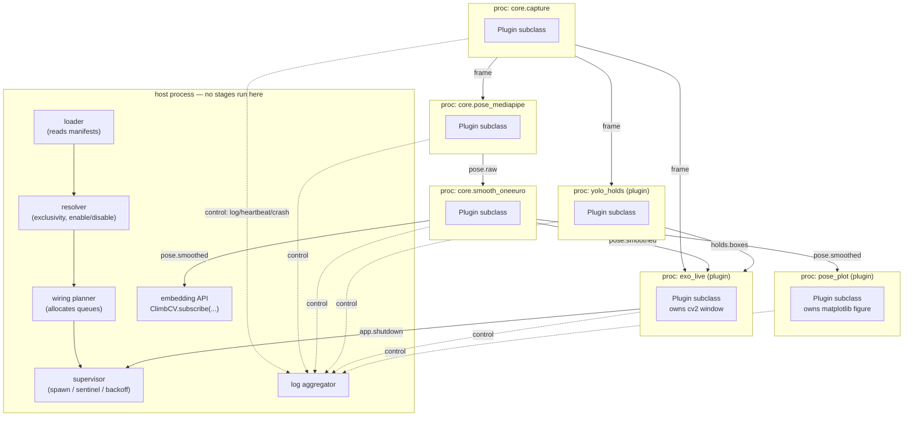

# Design: Topic Broker

Owner: `framework-core` · Status: **proposed, awaiting review** · Implements Decision #9 (Approach 1)

Companion sections: [`payloads.md`](payloads.md) (what flows over topics), [`isolation.md`](isolation.md)
(process lifecycle), [`loader.md`](loader.md) (where the topic graph comes from),
[`plugin-api.md`](plugin-api.md) (what an author writes), [`config-contract.md`](config-contract.md).

---

## 1. What the broker is

A **static, statically-wired, brokerless pub/sub fabric.** At startup the host process reads every
plugin manifest, computes the complete topic graph, allocates the queues that graph implies, and
hands each child process exactly the queue endpoints it needs. After that, messages travel
**directly from publisher process to subscriber process**. There is no message-forwarding process
in the data path.

"Broker" in this document therefore names a *startup-time component* (the registry + resolver +
wiring planner) and a *runtime library* (publish/subscribe helpers linked into every process), not a
daemon.

### 1.1 Architecture



Solid arrows are the **data plane** (direct, peer-to-peer, lossy, never blocking). Dotted arrows are
the **control plane** (low volume, to the host: logs, heartbeats, crash reports, lifecycle).

### 1.2 Why brokerless — alternatives rejected

| Option | Why not |
|---|---|
| **A. Central broker process.** Everything goes publisher → broker → subscribers. | Two serialisations per message per hop and one extra process wake-up on the 30 fps frame path. The broker becomes the throughput ceiling for the whole app and a single point of failure that no amount of per-plugin fault tolerance protects against. Buys runtime (re)subscription, which Assumption §3 says we do not need (no hot reload). |
| **B. Shared-memory ring per topic, subscribers self-register at runtime.** | Requires a cross-process registry with locking, and dynamic membership means the "exactly one publisher on an exclusive topic" check becomes a runtime race instead of a startup check with a good error message. Fail-late instead of fail-fast, for capability we do not need. |
| **C. Chosen: static peer-to-peer wiring + a control plane.** | One serialisation per message per subscriber. Exclusivity is enforced *before any process starts*, which is exactly when a clear error is most useful. Directly generalises the pattern already in the codebase — `climbcv._initialize_runtime_workers` creates the YOLO queues in the parent and hands them to the child at spawn. |

The cost of C is that **fan-out is paid by the publisher**: three subscribers to `frame` means the
capture plugin serialises the frame three times. §5 quantifies this and states the resolution
ceiling it implies.

---

## 2. Topic descriptors — the registry

A topic is fully described by a `TopicDescriptor`. Descriptors are *declarations*, and they come
from two places, uniformly:

- **The framework** declares the **standard topic set** (`climbcv.topics`) — a shipped interop
  vocabulary, versioned with the plugin API version.
- **Any plugin** declares topics it invents, in its manifest.

```python
@dataclass(frozen=True, slots=True)
class TopicDescriptor:
    name: str                      # "pose.smoothed"
    kind: Kind                     # STREAM | EVENT     -> delivery/backpressure policy
    exclusivity: Exclusivity       # EXCLUSIVE | SHARED  -> how many publishers may exist
    schema: str                    # "pose.smoothed/1"  -> diagnostic id for the payload contract
    payload: type                  # climbcv.contracts.PoseFrame
    declared_by: str               # "core" | plugin id  -> for conflict error messages
    doc: str                       # one line, shown by `climbcv topics`
```

Two important consequences of putting descriptors on the same footing regardless of origin:

1. **Framework-declared ≠ framework-owned.** The framework declares `holds.boxes` so that *any*
   hold detector interoperates with *any* overlay without the two authors ever meeting. It does not
   follow that the framework publishes it — no built-in stage does.
2. **`exclusivity` is not a framework privilege.** A third-party plugin may declare a topic
   exclusive (e.g. `acme.route_map`, of which there should be exactly one). If only the framework
   could mint exclusive topics, we would have reintroduced a finite hardcoded set of "core slots" —
   the precise reason Approach 3 was rejected. See Invariant "no structural ceilings".

### 2.1 Naming

- `climbcv.*` — **reserved**, framework-internal, never author-facing.
- The standard topic set occupies a flat documented namespace: `frame`, `pose.raw`,
  `pose.smoothed`, `holds.boxes`, `device.lid_angle`, `app.shutdown`, `app.status`.
- Third-party topics: **recommended** `<vendor_or_plugin_id>.<signal>` (e.g. `acme.grip_strength`).
  Not enforced, because two plugins agreeing on an unprefixed community topic name is how an
  ecosystem standardises, and forbidding it would push that coordination outside the system. Name
  collisions are caught by the startup conflict check (§4.3), which names both plugins.
- Grammar: `[a-z][a-z0-9_]*(\.[a-z][a-z0-9_]*)*`, ≤ 64 chars. Rejected at manifest parse with the
  offending string quoted.

---

## 3. Exclusive vs. shared: the criterion

§5 of `BRAINSTORM.md` enumerates which topics are exclusive. An enumeration is a structural ceiling
in disguise — the next person adding a topic has no way to decide. Replace it with a rule:

> **A topic is EXCLUSIVE iff its payload is a singleton observation of a unique subject** — such
> that two simultaneous publishers would make *mutually contradictory*, not merely *additive*,
> statements about the world. Otherwise it is SHARED.

Worked applications:

| Topic | Verdict | Reasoning |
|---|---|---|
| `frame` | **exclusive** | There is one feed. "Which one is *the* frame?" has no answer with two publishers; every `frame_seq` reference downstream would be ambiguous. |
| `pose.raw`, `pose.smoothed` | **exclusive** | One canonical skeleton. Downstream geometry (body tilt, joint angles, the saved `.npy`) is computed *from* a single skeleton; two skeletons are contradictory, not additive. |
| `device.lid_angle` | **exclusive** | Singleton observation of one hinge. Two publishers contradict. (A phone-gyro equivalent is a *different* subject and belongs on a different topic.) |
| `holds.boxes` | **shared** — see §3.1 | Set-valued. The union of two detectors' boxes is still a valid set of detected boxes. |
| `app.shutdown` | shared | Anyone may ask to stop. |

### 3.1 Recommendation: `holds.boxes` should be SHARED, not exclusive

This reverses §5 of `BRAINSTORM.md`. Four arguments, in ascending order of weight:

1. **It fails the criterion.** Boxes are a set of independent observations, not one observation of
   one subject. Two hold detectors running together produce a larger set of hold detections, which
   is a coherent thing. Two pose estimators running together produce two incompatible skeletons,
   which is not.

2. **The plural case is ordinary, not exotic.** A YOLO detector, a colour-segmentation detector
   tuned to one gym's route tape, a hand-annotated route map loaded from JSON, a depth-camera
   detector. "Show me the model's detections *and* my annotated route" is a first-session request,
   not an edge case.

3. **Reversibility is asymmetric.** Shared → exclusive later is a config change (name one owner) and
   is non-breaking for subscribers: they simply stop seeing a second source. Exclusive → shared
   later is a **breaking change for every subscriber**, because the delivery contract flips from
   "one message per detection cycle" to "N messages per cycle, one per detector," and any subscriber
   that was overwriting state per message now needs to merge by source. Given genuine uncertainty,
   pick the direction that is cheap to reverse.

4. **Decision #7 makes hold detection a first-party plugin.** If `holds.boxes` is exclusive, the
   first-party hold detector holds a slot that a competitor can only take by *displacing* it via
   config. That is a privilege the plugin model is not supposed to grant to anything — it is
   Approach 3's fixed-slot problem reappearing at the topic level after we rejected it at the
   framework level.

**The objection, and why it doesn't hold.** "Two detectors will draw overlapping duplicate boxes."
True and correct — that *is* the honest rendering of "two detectors both ran." It is only a problem
if subscribers cannot tell the boxes apart, and they can: every message carries a framework-injected
`meta.source` (the publishing plugin's id — see `payloads.md` §2). An overlay can colour by source,
filter to one source, or draw everything. The author of the overlay never had to know a second
detector existed.

**Cost accepted.** A user who drops in two hold detectors gets doubled boxes with no error, rather
than a startup message telling them to choose. Mitigation is diagnostic, not structural:
`climbcv topics` (§7) prints every topic with its resolved publisher list, so "why do I see two sets
of boxes" is one command away.

`holds.boxes` **stays in the standard topic set** — §5's instinct that it is a core topic was right.
Only its exclusivity flips. Being in the standard set means the framework fixes its payload contract
so detectors and overlays interoperate blind; it does not mean the framework publishes it.

---

## 4. Resolution: who publishes what

Runs in the host, on parsed manifests only, **before any child process is spawned**. Deterministic
and side-effect-free, so it is directly unit-testable without spawning anything —
see `docs-and-testing` handoff in §8.

### 4.1 Inputs

- Descriptors from `climbcv.topics` (the standard set).
- Descriptors from each enabled plugin's manifest (`[[publishes]]` entries for non-standard topics).
- Each enabled plugin's `publishes` / `subscribes` lists.
- Built-in core stages, which are registered as **ordinary candidate publishers from a built-in
  provider set** — not as privileged defaults. `core.pose_mediapipe` competes for `pose.smoothed`
  by the same rules as a third-party plugin.
- `config["topics"]` — explicit ownership assignments (see `config-contract.md`).

### 4.2 Algorithm

For each topic that any enabled plugin publishes or subscribes to:

1. **Merge descriptors.** All declarations of the same topic name must agree on `kind`,
   `exclusivity`, and `schema`. A standard-set topic's descriptor always wins and a plugin
   re-declaring it differently is an error (§4.3, case *contradiction*).
2. **Gather candidate publishers** = every enabled plugin (built-in or third-party) declaring
   `[[publishes]] topic = <name>`.
3. **If SHARED** → all candidates publish. Zero candidates is fine.
4. **If EXCLUSIVE:**
   - `config["topics"][name]["publisher"]` names an owner → use it. If the named plugin is not a
     candidate → **fatal**, listing the actual candidates.
   - exactly one candidate → use it, silently.
   - **more than one candidate and no config → fatal.** This is the "framework refuses to start a
     second publisher" requirement from Decision #9. Error text includes the paste-ready TOML.
   - zero candidates → the topic is **absent**. Not an error in itself; see step 5.
5. **Check subscriptions.** For each subscriber of an absent topic:
   - subscription is `required = true` (the default) → **fatal**, naming the starved plugins.
   - subscription is `required = false` → wire nothing; the plugin runs and simply never receives
     that topic. This is what makes `device.lid_angle` work: absent on Linux, and the overlay
     declares its subscription optional.
6. **Emit a `WiringPlan`** (§6).

`required` defaulting to **true** is deliberate: a mistyped topic name that silently delivers
nothing forever is one of the worst authoring experiences pub/sub has, and it is the single most
common way to lose an afternoon. Default-true converts it into a startup error naming the typo and
the nearest valid topic name.

### 4.3 Fatal conditions and their messages

Error text *is* the documentation for a drop-in ecosystem with no install step. These are specified,
not sketched.

**Exclusive-topic contention:**
```
climb-cv cannot start: 2 plugins both want to publish the exclusive topic 'pose.smoothed'.

  core.smooth_oneeuro   (built in)                        OneEuroFilter smoothing
  kalman_smooth  1.2.0  plugins/kalman_smooth/            Kalman-filter pose smoothing

'pose.smoothed' is exclusive: exactly one publisher, because subscribers compute geometry
from a single skeleton and two would contradict each other.

Choose one in climbcv.toml:

    [topics."pose.smoothed"]
    publisher = "kalman_smooth"

Or disable the one you don't want:

    [plugins.kalman_smooth]
    enabled = false
```

**Starved required subscription:**
```
climb-cv cannot start: nothing publishes 'holds.boxes', but 1 plugin requires it.

  exo_live  1.0.0  plugins/exo_live/   subscribes to 'holds.boxes' (required)

Either install/enable a plugin that publishes 'holds.boxes', or — if exo_live should
run without hold boxes — its author should mark the subscription optional in
plugins/exo_live/climbcv-plugin.toml:

    [[subscribes]]
    topic = "holds.boxes"
    required = false
```

**Unknown topic (with suggestion):**
```
Plugin 'my_analyzer' (plugins/my_analyzer/climbcv-plugin.toml, line 14) subscribes to
'pose.smooth', which no plugin publishes and which is not a standard climb-cv topic.

Did you mean 'pose.smoothed'?

Standard topics: frame, pose.raw, pose.smoothed, holds.boxes, device.lid_angle,
                 app.shutdown, app.status
Run `climbcv topics` to see every topic in your current setup.
```

**Descriptor contradiction:**
```
climb-cv cannot start: two plugins describe the topic 'grip.force' incompatibly.

  grip_sensor  declares it kind="event"   (plugins/grip_sensor/)
  grip_viz     declares it kind="stream"  (plugins/grip_viz/)

A topic has one kind for everyone who uses it. 'stream' means only the newest value
matters and older ones may be dropped; 'event' means each occurrence should be delivered.
The two authors need to agree — usually the publisher is right.
```

Non-fatal warnings use the same voice: `[plugins.yolo_hold]` for a plugin that does not exist →
`no plugin with id 'yolo_hold' was found in plugins/ — did you mean 'yolo_holds'?`

---

## 5. Transport: how messages actually cross a process boundary

### 5.1 Queue topology — two queues per subscriber, not per topic

The naive design is one `multiprocessing.Queue` per `(topic, subscriber)` pair. Rejected: the child
then has to wait on N queues at once, and `mp.Queue` exposes no waitable file descriptor, so
multi-queue waiting forces `Pipe`/`Connection` — and `Connection.send` **blocks** when the OS pipe
buffer fills, which would destroy the never-block guarantee the moment a subscriber stalled on a
frame.

Chosen instead: **every subscriber process owns exactly two inbound queues**, one per delivery
class. The envelope carries the topic name and the child demultiplexes.

| Queue | Backs | Depth | On full | Child access |
|---|---|---|---|---|
| **stream queue** | all `kind = STREAM` topics | `max(4, 2 × stream subscriptions)` — see §5.1.1 | publisher drops **oldest**, then puts | blocking `get(timeout = next timer due)` |
| **event queue** | all `kind = EVENT` topics | 256 (`event_depth`) | publisher drops **newest** + logs a rate-limited WARNING attributed to the *slow subscriber* | drained non-blocking, **before** the stream queue, every loop turn |

Why the split matters: with one queue, a 30 fps burst of frames evicts a pending `app.shutdown`.
Splitting by delivery class means the stream/event distinction in the manifest does real mechanical
work rather than being advisory. Two queues per process is a fixed cost independent of how many
topics a plugin subscribes to.

**Per-topic conflation happens on the read side.** Each loop turn the child drains everything
currently available from the stream queue and keeps **only the newest message per topic**, then
dispatches. A slow plugin therefore naturally receives the freshest value of each topic it cares
about, rather than working through a backlog it can never catch up on. This is ~5 lines and it is
the whole of the backpressure story from the author's perspective (they see none of it).

#### 5.1.1 Cross-topic starvation, and why the depth is not a constant

One shared stream queue with global drop-oldest has a failure mode worth naming, because the obvious
constant depth is wrong. The overlay plugin subscribes to four stream topics (`frame`,
`pose.smoothed`, `holds.boxes`, `device.lid_angle`). At depth 4, a burst from the 30 fps `frame`
publisher can occupy every slot and evict the pending `pose.smoothed` message before the subscriber
gets a turn — so a slow overlay would receive frames and **no pose**, indefinitely. That is
starvation, not conflation, and read-side conflation cannot recover a message that was already
evicted.

Per-topic eviction would fix it but is not available: a publisher on a shared queue only knows its
own topic and cannot selectively evict another's. Reverting to one queue per (topic, subscriber)
reintroduces the multi-queue waiting problem this section exists to avoid.

Fix: **depth scales with the subscription count**, computed per subscriber at wiring time —
`stream_depth = max(4, 2 × number of STREAM topics subscribed)`. Two average slots per topic bounds
the starvation window without eliminating it in the pathological case. It costs only memory for
in-flight payloads (a frame subscriber at 320×240 with 4 topics holds up to 8 × 230 KB ≈ 1.8 MB) and
costs nothing in latency, since the child drains the whole queue every turn regardless. `stream_depth`
in config overrides the computed value for anyone who needs to tune it; nothing about this is visible
to a plugin author.

### 5.2 Publish is non-blocking, always

```python
# publisher side, per subscriber queue — generalised directly from
# climbcv._queue_yolo_frame / _queue_plot_landmarks in the existing code
for q in self._out[topic]:
    try:
        if q.full():
            q.get_nowait()          # drop oldest
    except Empty:
        pass
    try:
        q.put_nowait(envelope)
    except Full:
        self._dropped[topic] += 1   # counted, reported, never raised
```

Notes an implementer must not rediscover the hard way:

- `mp.Queue.qsize()` raises `NotImplementedError` on macOS. `full()` does **not** — it reads the
  bounding semaphore. The existing code relies on exactly this and works on macOS. Use `full()`;
  never `qsize()`.
- The drop-oldest read between `full()` and `put_nowait()` is race-free **only because each queue has
  exactly one consumer.** *Single-consumer-per-queue is a structural invariant of this design*, not
  an incidental property. It is what makes the whole scheme lock-free.
- `mp.Queue` has a feeder thread, so `put_nowait` does not block on a full OS pipe; the bound is
  enforced by the semaphore, not the pipe.
- Use plain `multiprocessing.Queue`, **not** `Manager().Queue()`. The existing code uses a Manager
  queue for plotting; every operation on it round-trips through the manager process. Manager is
  retained only for the shutdown `Event` — or dropped entirely in favour of `mp.Event`, which needs
  no manager process at all. Recommend `mp.Event`; this removes one process from the tree relative
  to today.

### 5.3 Serialisation and the resolution ceiling

Default pickle over `mp.Queue`. Payloads are numpy arrays and primitives (`payloads.md`), all of
which pickle efficiently.

Concrete budget at the current default capture size (320×240 BGR = 230,400 B/frame), 30 fps, with
the default graph's **three** `frame` subscribers (pose, holds, overlay):

| Capture size | Bytes/frame | 30 fps × 3 subs | Verdict |
|---|---|---|---|
| 320×240 (today's default) | 230 KB | ~20 MB/s | fine |
| 640×480 | 922 KB | ~83 MB/s | borderline |
| 1280×720 | 2.76 MB | ~249 MB/s | **not viable** |

So: **the queue transport is adequate to roughly 640×480 with ≤3 frame subscribers.** Beyond that,
`frame` needs shared memory. This is a real ceiling and it is created by the full-isolation decision
in `isolation.md` §2 (capture and pose in different processes), so it belongs on the record here.

**A genuine choice, presented rather than picked:**

- **T1 — ship `queue` for every topic in v1;** reserve `transport` in `TopicDescriptor` and add
  `shm_ring` for `frame` in a later minor version.
- **T2 — ship `shm_ring` for `frame` in v1.** A ring of 4 pre-allocated
  `multiprocessing.shared_memory` blocks; the publisher writes into slot `seq % 4` and sends only
  `(slot, seq, shape, dtype, t_capture_ns)` on each subscriber's stream queue; subscribers take a
  zero-copy numpy view. Overwrite-tolerant by design (the publisher never waits for a reader), with
  a seqlock — sequence number written to the slot header before the pixels and to a tail field
  after; a reader accepts only if head == tail == the seq it was told — so a lapped reader detects
  the tear and drops the frame instead of rendering garbage.

**Recommend T1.** The decisive argument is that `transport` is chosen by the framework from the
topic descriptor and is *never visible in the authoring interface* — a plugin's `on_frame(self,
frame, meta)` is byte-identical under both. So T2 is a **non-breaking upgrade available at any
time**, which means shipping it in v1 buys nothing that waiting doesn't, while costing the riskiest
code in the framework (shared-memory lifetime across crashing children) during the period when
everything else is also new. T2's design is recorded above so the door stays open, and the ceiling
table above tells us exactly when to walk through it.

A hard consequence either way: **`climbcv.contracts` and `climbcv.plugin` must import nothing beyond
the standard library and numpy.** Under `spawn` they are re-imported in every child, so any
dependency added there is multiplied by the process count *and* imposed on every plugin author.

### 5.4 Delivery guarantees, stated plainly

Authors must know these. They are domain facts ("you get the freshest data, not every datum"), not
concurrency mechanics, so stating them does not violate the "authors need no concurrency knowledge"
invariant — hiding them would.

- **Within one (publisher, topic, subscriber) triple:** order preserved; messages may be **dropped**.
- **STREAM topics:** best-effort, lossy by design. A subscriber slower than the publisher sees the
  newest value each turn and misses the ones between. Handler code must be written per-message and
  stateless-ish; it must not assume it sees every frame.
- **EVENT topics:** lossless under normal operation. Drops occur only under sustained overload and
  are logged with an attribution to the slow subscriber. Not a durable queue; nothing survives a
  process death.
- **Across topics:** no ordering relationship. `pose.smoothed` for frame 100 may arrive before or
  after `holds.boxes` for frame 100. Payloads carry `frame_seq` so consumers can correlate; see the
  declared join in `plugin-api.md` §4.3.
- **Across publishers on a shared topic:** no ordering, no fairness guarantee.
- **No replay, no durability, no acknowledgement.** A subscriber that starts late has missed
  everything before it started.

---

## 6. The WiringPlan

Resolution's output. A pure data structure, fully serialisable, which is what makes the whole
startup path testable without spawning a process.

```python
@dataclass(frozen=True)
class Subscription:
    topic: str
    required: bool

@dataclass(frozen=True)
class PluginPlan:
    plugin_id: str
    root: Path                       # plugins/<dir>/ or None for built-ins
    entry: str                       # "plugin:YoloHolds"
    config: dict                     # opaque section from climbcv.toml
    publishes: tuple[str, ...]
    subscribes: tuple[Subscription, ...]

@dataclass(frozen=True)
class WiringPlan:
    plugins: tuple[PluginPlan, ...]
    topics: Mapping[str, TopicDescriptor]
    publishers: Mapping[str, tuple[str, ...]]      # topic -> plugin ids (len 1 if exclusive)
    subscribers: Mapping[str, tuple[str, ...]]     # topic -> plugin ids
    absent: frozenset[str]                         # declared, nothing publishes, all subs optional
```

The host then allocates, for each plugin, `stream_q` and `event_q`, and gives each publisher the
write ends of its subscribers' queues keyed by topic. A plugin's process receives only:
its own two read ends, a `dict[topic, list[write-end]]`, the control-queue write end, the shutdown
`Event`, its `PluginPlan`, and the frozen topic descriptors for the topics it touches. Nothing else
— in particular, **no live objects from the host and no other plugin's endpoints.**

---

## 7. Observability: `climbcv topics`

A CLI that prints the resolved graph without starting the pipeline. This is not a nicety — with
implicit resolution rules (single candidate auto-wins) and shared topics (two publishers is legal),
"who is actually producing this" must be answerable in one command, or every ecosystem bug report
becomes archaeology.

```
$ climbcv topics
topic              kind    excl.  publisher(s)              subscriber(s)
frame              stream  excl   core.capture              core.pose_mediapipe, yolo_holds, exo_live
pose.raw           stream  excl   core.pose_mediapipe       core.smooth_oneeuro
pose.smoothed      stream  excl   core.smooth_oneeuro       exo_live, pose_plot, core.persist_npy, <host>
holds.boxes        stream  shared yolo_holds, route_map      exo_live
device.lid_angle   stream  excl   — (absent: mac_lid skipped, platform darwin != linux)
app.shutdown       event   shared exo_live, <host>          <host>

2 warnings — run `climbcv topics -v` for detail.
```

Companion: `climbcv validate ./plugins/my_plugin` imports the plugin **in a throwaway subprocess**
and reports manifest/code divergence (see `loader.md` §5).

---

## 8. Handoffs and open items

**To `plugins-and-config`:**
- `holds.boxes` is shared, so the first-party YOLO plugin must set `frame_seq` and must not assume
  it is the only hold source.
- The overlay plugin now owns the `cv2` window **and therefore the keyboard/quit path**; it must
  publish `app.shutdown` on ESC. That topic exists for this reason.
- `device.lid_angle` subscriptions must be declared `required = false`.
- `replay()` is expressible as a plugin publishing `pose.smoothed` from a `.npy` file — i.e. a swap
  of the exclusive publisher, with the normal pipeline downstream. Recommend building it that way;
  it is the cheapest end-to-end proof that exclusive-topic swapping works.

**To `docs-and-testing`:** resolution (§4) and wiring (§6) are pure functions over parsed manifests
and a config dict. They should carry the bulk of the framework's test weight — every fatal condition
in §4.3 is a table-driven test with no processes involved.

**Ready for `plugin-api-guardian`:** §2.1 (naming), §3 (exclusivity criterion), §4.2–4.3
(resolution rules and every error string), §5.4 (delivery guarantees as authors must understand
them), §7 (CLI output).

**Open / deferred:**
- T1 vs T2 in §5.3 wants a decision even though T1 is recommended.
- **Co-location escape hatch — deliberately deferred, not in v1.** Running a stage as a host thread
  instead of a child process would remove two IPC hops for `core.smooth_oneeuro` (whose actual work
  is ~50 µs of numpy). Deferred because it creates a second execution mode that must behave
  identically to the first, and it silently voids fault containment for the co-located plugin. The
  door is documented; the code stays one path.
