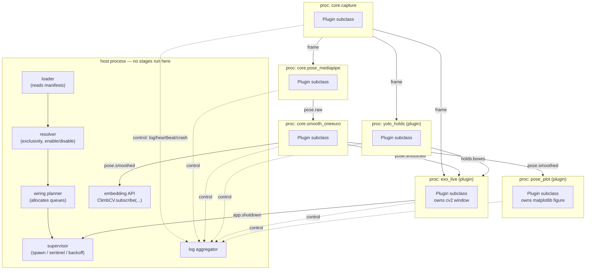

# Design: Topic Broker

Owner: `framework-core` · Status: **revised 2026-08-07 (revision 01)** · Implements Decision #9
(Approach 1)

Companion sections: [`payloads.md`](payloads.md) (what flows over topics), [`isolation.md`](isolation.md)
(process lifecycle), [`loader.md`](loader.md) (where the topic graph comes from),
[`plugin-api.md`](plugin-api.md) (what an author writes), [`config-contract.md`](config-contract.md).

Revision 01 actions guardian S7, S9, S10, and the `app.shutdown` and grayscale notes; F-6, F-11, F-14;
and settles T1 vs T2. Changelog: [`revision-01.md`](revision-01.md).

---

## 1. What the broker is

A **static, statically-wired, brokerless pub/sub fabric.** At startup the host process reads every
plugin manifest, computes the complete topic graph, allocates the queues that graph implies, and
hands each child process exactly the queue endpoints it needs. After that, messages travel
**directly from publisher process to subscriber process**. There is no message-forwarding process
in the data path.

"Broker" in this document therefore names a *startup-time component* (the registry + resolver +
wiring planner) and a *runtime library* (publish/subscribe helpers linked into every process), not a
daemon.

### 1.1 Architecture



Solid arrows are the **data plane** (direct, peer-to-peer, lossy, never blocking). Dotted arrows are
the **control plane** (low volume, to the host: logs, heartbeats, crash reports, lifecycle).

### 1.2 Why brokerless — alternatives rejected

| Option | Why not |
|---|---|
| **A. Central broker process.** Everything goes publisher → broker → subscribers. | Two serialisations per message per hop and one extra process wake-up on the 30 fps frame path. The broker becomes the throughput ceiling for the whole app and a single point of failure that no amount of per-plugin fault tolerance protects against. Buys runtime (re)subscription, which Assumption §3 says we do not need (no hot reload). |
| **B. Shared-memory ring per topic, subscribers self-register at runtime.** | Requires a cross-process registry with locking, and dynamic membership means the "exactly one publisher on an exclusive topic" check becomes a runtime race instead of a startup check with a good error message. Fail-late instead of fail-fast, for capability we do not need. |
| **C. Chosen: static peer-to-peer wiring + a control plane.** | One serialisation per message per subscriber. Exclusivity is enforced *before any process starts*, which is exactly when a clear error is most useful. Directly generalises the pattern already in the codebase — `climbcv._initialize_runtime_workers` creates the YOLO queues in the parent and hands them to the child at spawn. |

The cost of C is that **fan-out is paid by the publisher**: three subscribers to `frame` means the
capture plugin serialises the frame three times. §5 quantifies this and states the resolution
ceiling it implies.

---

## 2. Topic descriptors — the registry

A topic is fully described by a `TopicDescriptor`. Descriptors are *declarations*, and they come
from two places, uniformly:

- **The framework** declares the **standard topic set** (`climbcv.topics`) — a shipped interop
  vocabulary, versioned with the plugin API version.
- **Any plugin** declares topics it invents, in its manifest.

```python
@dataclass(frozen=True, slots=True)
class TopicDescriptor:
    name: str                      # "pose.smoothed"
    kind: Kind                     # STREAM | EVENT     -> delivery/backpressure policy
    exclusivity: Exclusivity       # EXCLUSIVE | SHARED  -> how many publishers may exist
    schema: str                    # "pose.smoothed/1"  -> diagnostic id for the payload contract
    payload: type                  # climbcv.contracts.PoseFrame
    unit: str | None               # required iff payload is Scalar -- see payloads.md §3.4
    standard: bool                 # True for the shipped interop vocabulary (§2.1)
    declared_by: str               # "core" | plugin id  -> for conflict error messages
    doc: str                       # one line, shown by `climbcv topics`
```

`unit` is added per guardian S13 and joins the merge-equality check in §4.2. `standard` is added so
§4.4's config overrides can refuse to redefine a shipped topic without a name-prefix test.

Two important consequences of putting descriptors on the same footing regardless of origin:

1. **Framework-declared ≠ framework-owned.** The framework declares `holds.boxes` so that *any*
   hold detector interoperates with *any* overlay without the two authors ever meeting. It does not
   follow that the framework publishes it — no built-in stage does.
2. **`exclusivity` is not a framework privilege.** A third-party plugin may declare a topic
   exclusive (e.g. `acme.route_map`, of which there should be exactly one). If only the framework
   could mint exclusive topics, we would have reintroduced a finite hardcoded set of "core slots" —
   the precise reason Approach 3 was rejected. See Invariant "no structural ceilings".

### 2.1 Naming

- `climbcv.*` — **reserved**, framework-internal, never author-facing.
- The standard topic set occupies a flat documented namespace: `frame`, `pose.raw`,
  `pose.smoothed`, `holds.boxes`, `device.lid_angle`, `app.shutdown`, `app.status`.
- Third-party topics: **recommended** `<vendor_or_plugin_id>.<signal>` (e.g. `acme.grip_strength`).
  Not enforced, because two plugins agreeing on an unprefixed community topic name is how an
  ecosystem standardises, and forbidding it would push that coordination outside the system. Name
  collisions are caught by the startup conflict check (§4.3), which names both plugins.
- Grammar: `[a-z][a-z0-9_]*(\.[a-z][a-z0-9_]*)*`, ≤ 64 chars. Rejected at manifest parse with the
  offending string quoted.

---

## 3. Exclusive vs. shared: the criterion

§5 of `BRAINSTORM.md` enumerates which topics are exclusive. An enumeration is a structural ceiling
in disguise — the next person adding a topic has no way to decide. Replace it with a rule:

> **A topic is EXCLUSIVE iff its payload is a singleton observation of a unique subject** — such
> that two simultaneous publishers would make *mutually contradictory*, not merely *additive*,
> statements about the world. Otherwise it is SHARED.

Worked applications:

| Topic | Verdict | Reasoning |
|---|---|---|
| `frame` | **exclusive** | There is one feed. "Which one is *the* frame?" has no answer with two publishers; every `frame_seq` reference downstream would be ambiguous. |
| `pose.raw`, `pose.smoothed` | **exclusive** | One canonical skeleton. Downstream geometry (body tilt, joint angles, the saved `.npy`) is computed *from* a single skeleton; two skeletons are contradictory, not additive. |
| `device.lid_angle` | **exclusive** | Singleton observation of one hinge. Two publishers contradict. (A phone-gyro equivalent is a *different* subject and belongs on a different topic.) |
| `holds.boxes` | **shared** — see §3.1 | Set-valued. The union of two detectors' boxes is still a valid set of detected boxes. |
| `app.shutdown` | shared | Anyone may ask to stop. |

### 3.1 Recommendation: `holds.boxes` should be SHARED, not exclusive

This reverses §5 of `BRAINSTORM.md`. Four arguments, in ascending order of weight:

1. **It fails the criterion.** Boxes are a set of independent observations, not one observation of
   one subject. Two hold detectors running together produce a larger set of hold detections, which
   is a coherent thing. Two pose estimators running together produce two incompatible skeletons,
   which is not.

2. **The plural case is ordinary, not exotic.** A YOLO detector, a colour-segmentation detector
   tuned to one gym's route tape, a hand-annotated route map loaded from JSON, a depth-camera
   detector. "Show me the model's detections *and* my annotated route" is a first-session request,
   not an edge case.

3. **Reversibility is asymmetric.** Shared → exclusive later is a config change (name one owner) and
   is non-breaking for subscribers: they simply stop seeing a second source. Exclusive → shared
   later is a **breaking change for every subscriber**, because the delivery contract flips from
   "one message per detection cycle" to "N messages per cycle, one per detector," and any subscriber
   that was overwriting state per message now needs to merge by source. Given genuine uncertainty,
   pick the direction that is cheap to reverse.

4. **Decision #7 makes hold detection a first-party plugin.** If `holds.boxes` is exclusive, the
   first-party hold detector holds a slot that a competitor can only take by *displacing* it via
   config. That is a privilege the plugin model is not supposed to grant to anything — it is
   Approach 3's fixed-slot problem reappearing at the topic level after we rejected it at the
   framework level.

**The objection, and why it doesn't hold.** "Two detectors will draw overlapping duplicate boxes."
True and correct — that *is* the honest rendering of "two detectors both ran." It is only a problem
if subscribers cannot tell the boxes apart, and they can: every message carries a framework-injected
`meta.source` (the publishing plugin's id — see `payloads.md` §2). An overlay can colour by source,
filter to one source, or draw everything. The author of the overlay never had to know a second
detector existed.

**Two corrections to that paragraph, from guardian B1 / F-1 — the premise was right and the API did not
deliver it.** Both reviews independently found that the three mitigations named above ("colour by
source, filter to one source, draw everything") were **unreachable through the only accessor the API
offered**: `self.latest(topic)` returned the newest payload and discarded the envelope, so a shared-topic
subscriber could not tell which publisher a value came from. In the exact pair used as this section's
motivating example, `route_map` publishing once and `yolo_holds` publishing every 4th frame, `latest()`
never returns the route map again from the first YOLO detection onward — annotated route invisible, no
error, no log. Fixed two ways, both now in place:

1. `self.latest_by_source(topic) -> Mapping[str, payload]` (`plugin-api.md` §3.5) makes all three
   mitigations one line each, and it is what the reference overlay example now uses for `holds.boxes`.
2. A wiring-time WARNING when any subscriber's topic resolved to more than one publisher (§4.2), so an
   overlay author who never imagined a second detector is told at startup rather than never.

**Cost accepted.** A user who drops in two hold detectors gets doubled boxes with no error, rather
than a startup message telling them to choose. Mitigation is diagnostic, not structural:
`climbcv topics` (§7) prints every topic with its resolved publisher list, so "why do I see two sets
of boxes" is one command away.

`holds.boxes` **stays in the standard topic set** — §5's instinct that it is a core topic was right.
Only its exclusivity flips. Being in the standard set means the framework fixes its payload contract
so detectors and overlays interoperate blind; it does not mean the framework publishes it.

---

## 4. Resolution: who publishes what

Runs in the host, on parsed manifests only, **before any child process is spawned**. Deterministic
and side-effect-free, so it is directly unit-testable without spawning anything —
see `docs-and-testing` handoff in §8.

### 4.1 Inputs

- Descriptors from `climbcv.topics` (the standard set).
- Descriptors from each enabled plugin's manifest (`[[publishes]]` entries for non-standard topics).
- Each enabled plugin's `publishes` / `subscribes` lists.
- Built-in core stages, which are registered as **ordinary candidate publishers from a built-in
  provider set** — not as privileged defaults. `core.pose_mediapipe` competes for `pose.smoothed`
  by the same rules as a third-party plugin.
- `config["topics"]` — explicit ownership assignments (see `config-contract.md`).

### 4.2 Algorithm

For each topic that any enabled plugin publishes or subscribes to:

1. **Merge descriptors.** All declarations of the same topic name must agree on `kind`,
   `exclusivity`, `schema`, and `unit`. A standard-set topic's descriptor always wins and a plugin
   re-declaring it differently is an error (§4.3, case *contradiction*). For a non-standard topic,
   `config["topics"][name]` may supply `kind` / `exclusivity` as a tie-break — §4.4.
2. **Gather candidate publishers** = every enabled plugin (built-in or third-party) declaring
   `[[publishes]] topic = <name>`, plus `<host>` if the embedding application declared a publish
   (`plugin-api.md` §7).
3. **If SHARED** → all candidates publish. Zero candidates is fine.
4. **If EXCLUSIVE:**
   - `config["topics"][name]["publisher"]` names an owner → use it, with the three cases in §4.4.
   - exactly one candidate → use it, silently.
   - **more than one candidate and no config → fatal.** This is the "framework refuses to start a
     second publisher" requirement from Decision #9. Error text includes the paste-ready TOML.
   - zero candidates → the topic is **absent**. Not an error in itself; see step 5.
5. **Check subscriptions.** For each subscriber of an absent topic:
   - subscription is `required = true` (the default) → **fatal**, naming the starved plugins.
     Overridable per topic by the user — §4.4.
   - subscription is `required = false` → wire nothing; the plugin runs and simply never receives
     that topic. This is what makes `device.lid_angle` work: absent on Linux, and the overlay
     declares its subscription optional.
6. **Check topology declarations** (`payloads.md` §4–§4.0). For every wired edge whose descriptor's
   payload is `PoseFrame`, both halves must have declared, and the subscriber's `requires_topology`
   must include the publisher's `provides_topology` or be `"any"`.
7. **Compute per-subscriber queue depths** from the subscription list, including each non-conflating
   subscription's own depth (§5.1.2).
8. **Emit a `WiringPlan`** (§6).

`required` defaulting to **true** is deliberate: a mistyped topic name that silently delivers
nothing forever is one of the worst authoring experiences pub/sub has, and it is the single most
common way to lose an afternoon. Default-true converts it into a startup error naming the typo and
the nearest valid topic name. `payloads.md` §4.0 now makes `requires_topology` mandatory on the same
reasoning, so the two safe-direction defaults are consistent.

**A wiring-time warning, added for guardian B1 / F-1.** After step 3, any subscriber of a topic that
resolved to **more than one publisher** gets one WARNING, because `latest()` collapses across
publishers and the author may not know a second one exists:

```
Plugin 'exo_live' subscribes to 'holds.boxes', which has 2 publishers in this setup:
yolo_holds, route_map.

If exo_live reads it with self.latest("holds.boxes") it will see whichever detector
published most recently and the two will alternate. Use self.latest_by_source(
"holds.boxes"), which returns {source_id: payload}, to see both.
```

This is a warning rather than an error because two publishers on a shared topic is legal and correct
by Decision #12; what is not acceptable is that it was previously invisible.

### 4.3 Fatal conditions and their messages

Error text *is* the documentation for a drop-in ecosystem with no install step. These are specified,
not sketched.

**Exclusive-topic contention:**
```
climb-cv cannot start: 2 plugins both want to publish the exclusive topic 'pose.smoothed'.

  core.smooth_oneeuro   (built in)                        OneEuroFilter smoothing
  kalman_smooth  1.2.0  plugins/kalman_smooth/            Kalman-filter pose smoothing

'pose.smoothed' is exclusive: exactly one publisher, because subscribers compute geometry
from a single skeleton and two would contradict each other.

Choose one in climbcv.toml:

    [topics."pose.smoothed"]
    publisher = "kalman_smooth"

Or disable the one you don't want:

    [plugins.kalman_smooth]
    enabled = false
```

**Starved required subscription** — two variants, because the fix differs and the second case is the
common one. Generic:
```
climb-cv cannot start: nothing publishes 'holds.boxes', but 1 plugin requires it.

  exo_live  1.0.0  plugins/exo_live/   subscribes to 'holds.boxes' (required)

Three ways out:

  1. Install or enable a plugin that publishes 'holds.boxes'.

  2. Tell climb-cv to run without it — add to ./climbcv.toml:

         [topics."holds.boxes"]
         required = false

  3. Ask exo_live's author to mark the subscription optional in
     plugins/exo_live/climbcv-plugin.toml:

         [[subscribes]]
         topic = "holds.boxes"
         required = false
```

Starved **because the user disabled the publisher** — the framework knows this and says so, instead of
making the user work out that their own config caused it:
```
climb-cv cannot start: nothing publishes 'pose.smoothed', but 3 plugins require it.

'core.smooth_oneeuro' publishes it, but ./climbcv.toml disables it:

    [plugins."core.smooth_oneeuro"]
    enabled = false

Disabling the publisher of an exclusive topic REMOVES the topic; it does not make the
topic optional. If you wanted smoothing switched off but the pipeline intact, use the
stage's own passthrough option instead:

    [plugins."core.smooth_oneeuro"]
    passthrough = true     # republish pose.raw unchanged as pose.smoothed

Requiring it: exo_live, pose_plot, core.persist_npy
```

That second message exists because of C-7. `plugins-and-config` found that today's
`smoothing_enabled = False` has **no translation** under this design: `enabled = false` on the resolved
publisher of an exclusive topic removes the topic and fatally starves everything downstream. The
`passthrough` option is the answer for that specific stage (`isolation.md` §8.3), and the general rule
— *disabling a stage is not the same as neutralising it* — is important enough that the error message
teaches it rather than leaving it to the guide.

**Unknown topic (with suggestion):**
```
Plugin 'my_analyzer' (plugins/my_analyzer/climbcv-plugin.toml, line 14) subscribes to
'pose.smooth', which no plugin publishes and which is not a standard climb-cv topic.

Did you mean 'pose.smoothed'?

Standard topics: frame, pose.raw, pose.smoothed, holds.boxes, device.lid_angle,
                 app.shutdown, app.status
Run `climbcv topics` to see every topic in your current setup.
```

**Descriptor contradiction:**
```
climb-cv cannot start: two plugins describe the topic 'grip.force' incompatibly.

  grip_sensor  declares it kind="event"   (plugins/grip_sensor/)
  grip_viz     declares it kind="stream"  (plugins/grip_viz/)

A topic has one kind for everyone who uses it. 'stream' means only the newest value
matters and older ones may be dropped; 'event' means each occurrence should be delivered.

The two authors need to agree. Until they do, you can settle it locally — add to
./climbcv.toml:

    [topics."grip.force"]
    kind = "stream"

Both plugins will then be wired with 'stream', whatever their manifests say.
```

Non-fatal warnings use the same voice: `[plugins.yolo_hold]` for a plugin that does not exist →
`no plugin with id 'yolo_hold' was found in plugins/ — did you mean 'yolo_holds'?`

**Every message in this section names its config source.** `config-contract.md` §1 supplies `source`
for exactly this purpose and no message previously used it (guardian S7). So: a message that quotes a
config value prefixes it with the source (`./climbcv.toml`, or `--config /path/to/x.toml`), and when
`source == "<defaults: no config file found>"` every paste-ready snippet is introduced with
**"Create ./climbcv.toml containing:"** rather than "add to climbcv.toml", because a user told to add a
stanza to a file that does not exist has been given half an instruction.

### 4.4 Local recourse: when a third party's declaration would otherwise be a wall (guardian S7)

Three startup fatals were reachable through declarations the user does not own and cannot edit, with no
local escape. All three now have one. The principle: **a user must never be unable to run the app
because two plugin authors disagree, or because a config file was written on a different machine.**

**(a) `[topics.<name>] exclusivity = / kind =`.** Two authors can legitimately disagree about a
community topic name, and the old contradiction message said "usually the publisher is right" — which
is meaningless when both of them are publishers. These keys override the merged descriptor.

Restricted in one way: an override **cannot change a `standard = true` topic.** The standard set is the
interop vocabulary — redefining `frame` as shared would break every subscriber's delivery
assumptions while appearing to work — so an attempt is a fatal naming the topic and the restriction.
For author-declared topics, which is where every real contradiction will occur, the override applies.
`exclusivity = "exclusive"` on a topic with several candidates then falls through to the normal
contention message, which prints the `publisher` stanza to add.

**(b) A named publisher that was benignly skipped.** `config["topics"][name]["publisher"]` naming a
plugin that is not a candidate was unconditionally fatal, which contradicted the reasoning already
applied to `platforms` — *"a Linux user running a config that mentions a mac-only plugin has done
nothing wrong."* A team sharing one `climbcv.toml` that pins a mac-only smoother gave every Linux
teammate a hard startup failure. Split three ways by whether the user made a mistake:

| Case | Behaviour |
|---|---|
| Named plugin was skipped for a benign reason (platform mismatch, `enabled = false`, `api_version`) or was never discovered | **WARNING**, fall back to the remaining candidates by the normal rules. Zero candidates left → the topic is absent, and step 5 applies. |
| Named plugin is enabled and running but does not publish that topic | **fatal.** There is no benign reading; it is a typo or a misunderstanding, and the candidate list is the useful answer. |
| Named plugin's manifest failed to parse | **WARNING** plus the parse error, fall back. The plugin is already broken and has already been reported. |

```
./climbcv.toml pins 'pose.smoothed' to 'mac_only_smooth', which is not running here
(skipped: platforms = ["darwin"], this machine is linux).

Falling back to the only other publisher: core.smooth_oneeuro.
```

**(c) A user-side subscription-optional override.** A starved required subscription was fixable only by
asking a third-party author to edit their manifest. `[topics.<name>] required = false` makes every
subscription to that topic optional:

```toml
[topics."holds.boxes"]
required = false
```

It is topic-scoped rather than per-plugin because the user's actual question is "let the app run
without hold boxes", not "let this one plugin run without them" — and the starved-subscription error
already names the topic, so the stanza it prints is the stanza that fixes it. It emits a WARNING at
startup naming the plugins affected, because a plugin whose author marked a subscription required may
behave oddly without it and the user should know which ones they just overrode.

The three overrides share a shape with `publisher`: they live under `[topics.<name>]`, they are
`plugins-and-config`'s to parse (`config-contract.md` §3.2), and none of them can be reached except by
a user who was just shown the exact stanza in an error message.

---

## 5. Transport: how messages actually cross a process boundary

### 5.1 Queue topology — two queues per subscriber, not per topic

The naive design is one `multiprocessing.Queue` per `(topic, subscriber)` pair. Rejected: the child
then has to wait on N queues at once, and `mp.Queue` exposes no waitable file descriptor, so
multi-queue waiting forces `Pipe`/`Connection` — and `Connection.send` **blocks** when the OS pipe
buffer fills, which would destroy the never-block guarantee the moment a subscriber stalled on a
frame.

Chosen instead: **every subscriber process owns exactly two inbound queues**, one per delivery
class. The envelope carries the topic name and the child demultiplexes.

| Queue | Backs | Depth | On full | Child access |
|---|---|---|---|---|
| **stream queue** | all `kind = STREAM` topics | computed per subscriber — see §5.1.1, §5.1.2 | publisher drops **oldest**, then puts | blocking `get(timeout = min(next timer due, 1 s))` |
| **event queue** | all `kind = EVENT` topics | 256 (`event_depth`) | publisher drops **newest** + logs a rate-limited WARNING attributed to the *slow subscriber* | drained non-blocking, **before** the stream queue, every loop turn |

Why the split matters: with one queue, a 30 fps burst of frames evicts a pending `app.shutdown`.
Splitting by delivery class means the stream/event distinction in the manifest does real mechanical
work rather than being advisory. Two queues per process is a fixed cost independent of how many
topics a plugin subscribes to.

**The blocking read is capped at 1 s even with no timers** — corrected in revision 01. The original
`timeout = next timer due, None if no timers` had a defect neither review caught: `isolation.md` §5.4
heartbeats "every 1 s **from the loop**", so a plugin with no timers whose input pauses would block in
`get(timeout=None)`, stop heartbeating, and be reported as **stalled after 5 s while being perfectly
healthy.** `pose_plot` — one subscription, no timers as originally sketched — is exactly that plugin.
Capping the read at the heartbeat interval costs one wakeup per second per idle plugin and removes a
false positive that would have read as a framework bug. Note it does *not* fix F-4's frozen window: the
loop turning over does not pump a GUI toolkit, only the plugin's own timer can (`plugin-api.md` §3.8).

**Per-topic conflation happens on the read side, and is now per-subscription.** Each loop turn the
child drains everything currently available from the stream queue and, **for subscriptions that
conflate (the default)**, keeps only the newest message per topic before dispatching. A slow plugin
therefore naturally receives the freshest value of each topic it cares about, rather than working
through a backlog it can never catch up on. From the author's perspective this is the whole of the
backpressure story, and they see none of it.

#### 5.1.0 `conflate = false`: the subscription that must not lose messages (F-14)

Conflation was **unconditional**, and `plugins-and-config` found the consequence while cross-checking
persistence: **a recorder is structurally unable to record every frame.** `core.persist_npy` subscribes
`pose.smoothed`, and in practice finds one message per loop turn and loses nothing — but "in practice"
is the problem. Any scheduling hiccup silently drops a frame from the recording, and the resulting
`.npy` is short by an unpredictable amount with no indication anywhere. Today's code records every
frame synchronously. Worse than the regression: **no third party can write a correct recorder on this
API**, which removes a whole category of plugin.

So `[[subscribes]]` gains `conflate`:

```toml
[[subscribes]]
topic    = "pose.smoothed"
required = true
conflate = false      # deliver every queued message, in arrival order
depth    = 64         # optional; how many to buffer. Default 64 when conflate = false.
```

Semantics, stated exactly because a recorder's correctness depends on them:

- **Every message the queue holds is dispatched, in arrival order**, in the turn it is drained. A turn
  may therefore dispatch up to `depth` messages for that topic.
- It is **still bounded, and therefore still lossy under real overload.** `conflate = false` buys "do
  not throw away data you already have"; it does not and cannot buy "never lose data", because the
  never-block invariant means a full queue drops. The honest claim is *not gratuitously lossy*.
- **A drop on a non-conflating subscription is logged at WARNING, once per 5 s per (topic,
  subscriber)**, with the running count. On a conflating subscription a drop is by design and is
  counted silently. This is the distinction that matters: for a recorder, a drop is data loss and must
  be visible in the log; for an overlay, it is Tuesday.
- **The subscriber can detect its own gaps** from `Meta.seq`, keyed by `meta.source` (`payloads.md`
  §2.4, §2.3). A correct recorder records the gap rather than pretending continuity —
  `isolation.md` §8.2 has `core.persist_npy` doing exactly that in its sidecar.
- `latest()` on a non-conflating topic still returns the newest known message, which may be *ahead* of
  the message a handler is currently processing. Specified in `plugin-api.md` §3.5.

Two things `conflate = false` is not allowed to become:

- **Not a default.** Every stream topic conflating is right for almost every plugin, and the failure
  mode of the wrong default here is a plugin working through a backlog it can never clear while its
  window freezes.
- **Not free on `frame`.** A non-conflating `frame` subscription at depth 64 holds 64 × 230 KB ≈ 15 MB
  in flight per subscriber and will still drop under load. The guide must say: record derived data, not
  pixels. A `max_stream_depth` framework knob (default 256) caps the arithmetic so a typo cannot ask
  for gigabytes.

#### 5.1.1 Cross-topic starvation, and why the depth is not a constant

One shared stream queue with global drop-oldest has a failure mode worth naming, because the obvious
constant depth is wrong. The overlay plugin subscribes to four stream topics (`frame`,
`pose.smoothed`, `holds.boxes`, `device.lid_angle`). At depth 4, a burst from the 30 fps `frame`
publisher can occupy every slot and evict the pending `pose.smoothed` message before the subscriber
gets a turn — so a slow overlay would receive frames and **no pose**, indefinitely. That is
starvation, not conflation, and read-side conflation cannot recover a message that was already
evicted.

Per-topic eviction would fix it but is not available: a publisher on a shared queue only knows its
own topic and cannot selectively evict another's. Reverting to one queue per (topic, subscriber)
reintroduces the multi-queue waiting problem this section exists to avoid.

Fix: **depth scales with the subscription count**, computed per subscriber at wiring time. Two average
slots per conflating topic bounds the starvation window without eliminating it in the pathological
case. It costs only memory for in-flight payloads (a frame subscriber at 320×240 with 4 topics holds up
to 8 × 230 KB ≈ 1.8 MB) and costs nothing in latency, since the child drains the whole queue every turn
regardless. Nothing about this is visible to a plugin author.

#### 5.1.2 The depth formula, and why its documented default is `0` (guardian S10)

```
stream_depth(subscriber) = max(4, 2 × n_conflating_stream_subs)
                         + Σ (depth of each non-conflating stream sub, default 64)
                         , capped at max_stream_depth (256)
```

`[framework] stream_depth` overrides the computed value for anyone who needs to tune it. **Its
documented default is `0`, meaning "computed", and never `4`** — a correction, because the original
listed `4` in two places (§8 and `config-contract.md` §2) while this section computed
`max(4, 2 × subs)`. A user copying the documented default into `climbcv.toml` would have pinned depth 4
and silently reintroduced the exact frame-evicts-pose starvation this section exists to prevent. A
documented default that breaks a mitigation when written down is worse than an undocumented one.

`climbcv topics -v` prints the resolved per-subscriber depth and the drop counters, so a tuned or
computed value is inspectable rather than folklore.

### 5.2 Publish is non-blocking, always

```python
# publisher side, per subscriber queue — generalised directly from
# climbcv._queue_yolo_frame / _queue_plot_landmarks in the existing code
for q in self._out[topic]:
    try:
        if q.full():
            q.get_nowait()          # drop oldest
    except Empty:
        pass
    try:
        q.put_nowait(envelope)
    except Full:
        self._dropped[topic] += 1   # counted, reported, never raised
```

Notes an implementer must not rediscover the hard way:

- `mp.Queue.qsize()` raises `NotImplementedError` on macOS. `full()` does **not** — it reads the
  bounding semaphore. The existing code relies on exactly this and works on macOS. Use `full()`;
  never `qsize()`.
- The drop-oldest read between `full()` and `put_nowait()` is race-free **only because each queue has
  exactly one consumer.** *Single-consumer-per-queue is a structural invariant of this design*, not
  an incidental property. It is what makes the whole scheme lock-free.
- `mp.Queue` has a feeder thread, so `put_nowait` does not block on a full OS pipe; the bound is
  enforced by the semaphore, not the pipe.
- Use plain `multiprocessing.Queue`, **not** `Manager().Queue()`. The existing code uses a Manager
  queue for plotting; every operation on it round-trips through the manager process. Manager is
  retained only for the shutdown `Event` — or dropped entirely in favour of `mp.Event`, which needs
  no manager process at all. Recommend `mp.Event`; this removes one process from the tree relative
  to today.

#### 5.2.1 One exception to "the data plane is lossy": `app.shutdown` reaching the supervisor

Guardian note: `app.shutdown` shared the generic event queue's drop-newest-when-full policy. Depth 256
makes loss unlikely, but the consequence is *"the ESC key silently did nothing"* — the one path in the
application that must never fail, and the reason the topic exists at all (full isolation moved
`cv2.waitKey` into the overlay's process).

Rule, stated so it is not a one-topic hack:

> **A topic whose subscriber is `<host>` in its supervisor role is delivered on the control queue, not
> on the host's data-plane event queue.**

Today that is `app.shutdown` and nothing else. The control queue is low-volume by construction (logs,
heartbeats, crash reports), the host drains it continuously in the supervisor thread, and a burst of
frames cannot reach it — so a published `app.shutdown` cannot be evicted by unrelated traffic. Plugin
subscribers of `app.shutdown` still receive it on the ordinary data plane and may still miss it under
overload, which is harmless: the supervisor's copy is the one that acts.

**Guarantee, stated plainly for the guide:** *a published `app.shutdown` always reaches the supervisor.*
Belt and braces: a dropped `app.shutdown` on any queue is logged at ERROR rather than counted, since by
this rule it should be unreachable and a log line beats a silent contradiction.

### 5.3 Serialisation and the resolution ceiling

Default pickle over `mp.Queue`. Payloads are numpy arrays and primitives (`payloads.md`), all of
which pickle efficiently.

Concrete budget at the current default capture size (320×240 BGR = 230,400 B/frame), 30 fps, with
the default graph's **three** `frame` subscribers (pose, holds, overlay):

| Capture size | Bytes/frame | 30 fps × 3 subs | Verdict |
|---|---|---|---|
| 320×240 (today's default) | 230 KB | ~20 MB/s | fine |
| 640×480 | 922 KB | ~83 MB/s | borderline |
| 1280×720 | 2.76 MB | ~249 MB/s | **not viable** |
| 640×480, `color = "gray"` | 922 KB | ~83 MB/s | same as colour — the replicated third channel costs 3× (`payloads.md` §3.1) |

Two corrections to how this table should be read, both from `plugins-and-config`:

- **The three `frame` subscribers are not alike (F-6).** Today's YOLO path moves 7.5 × 83 KB ≈
  **0.6 MB/s**, because the host downscales to 192×144 and enqueues every 4th frame. Under full
  isolation, capture serialises 30 × 230 KB ≈ **6.9 MB/s** to the holds process, of which the plugin
  discards three frames in four — an **11× increase on one edge, three quarters of it thrown away.** It
  fits inside the 320×240 budget so the verdict does not change, but the honest reading of the table is
  "two subscribers consume every frame and one consumes a quarter of them, and pays for all of them."
  The cheap v1.x mitigation is a subscription-level decimation declaration (`every_nth = 4`) so the
  *publisher* skips the serialisation; **declined for v1** as an optimisation with no correctness
  content, and recorded in §9 as the first thing to add if the ceiling bites.
- **Grayscale triples its own row.** Also recorded rather than fixed; see `payloads.md` §3.1.

So: **the queue transport is adequate to roughly 640×480 with ≤3 frame subscribers.** Beyond that,
`frame` needs shared memory. This is a real ceiling and it is created by the full-isolation decision
in `isolation.md` §2 (capture and pose in different processes), so it belongs on the record here.

**The two options:**

- **T1 — ship `queue` for every topic in v1;** reserve `transport` in `TopicDescriptor` and add
  `shm_ring` for `frame` in a later minor version.
- **T2 — ship `shm_ring` for `frame` in v1.** A ring of 4 pre-allocated
  `multiprocessing.shared_memory` blocks; the publisher writes into slot `seq % 4` and sends only
  `(slot, seq, shape, dtype, t_capture_ns)` on each subscriber's stream queue. Overwrite-tolerant by
  design (the publisher never waits for a reader), with a seqlock — sequence number written to the slot
  header before the pixels and to a tail field after; a reader accepts only if head == tail == the seq
  it was told — so a lapped reader detects the tear and drops the frame instead of rendering garbage.

### 5.3.1 T1 chosen — and the claim that made it look free was wrong

**Decision: T1.** But the reasoning has to change, because the argument originally given for it —
repeated and concurred with by the guardian — does not survive `plugins-and-config`'s F-11.

**The claim was:** `transport` is chosen by the framework from the topic descriptor and is *never
visible in the authoring interface*, so `on_frame(self, frame, meta)` is byte-identical under both and
**T2 is a non-breaking upgrade available at any time.**

**F-11 refutes it at the level that matters.** Under T1 each subscriber unpickles a private copy, so
`frame.pixels[:] = warped` is harmless — it does nothing useful, but it corrupts nobody. Under T2 the
same line writes into a buffer every other subscriber is reading. So the upgrade is non-breaking *at the
API level* and **data corruption at the authoring level**: a framework **minor** bump would turn working
plugins into silent cross-plugin corruption. That is the worst shape of change this project can ship, and
"the signature didn't change" is not a defence.

**The mechanism that actually decouples them is guardian B3, and it is sufficient for the write axis.**
`payloads.md` §2.2.1 makes every payload array read-only in **both** the publisher and — via
`__setstate__`, which is the part B3 as written would have missed — every subscriber. So in v1, under
T1, `frame.pixels[:] = warped` raises `ValueError: assignment destination is read-only`. No plugin that
mutates a payload array can ever ship and work. There is therefore no population of working plugins for
T2 to break, and the upgrade is genuinely non-breaking on the write axis. **This is the reason B3 had to
land before T2 could ever be considered, and it is why B3 is blocking rather than a nicety.**

**But read-only is not sufficient on its own, because there is a second axis: lifetime.** Read-only
prevents writes; it does not prevent a buffer's *contents* changing underneath a reader. Under a shm
ring of depth 4, a numpy view over slot `seq % 4` is overwritten by the publisher four frames later. And
retention is not an exotic pattern — it is one the framework itself performs and the design explicitly
recommends:

- `latest()` caches the newest payload per topic **across loop turns** (`plugin-api.md` §3.5).
- F-4's GUI idiom is *"the handler becomes a one-line stash and the expensive redraw happens on the
  tick"* — i.e. `self._last = frame` and read it later.

So under a naive zero-copy T2, `latest("frame")` and the blessed stash idiom would both return pixels
that had silently become a different frame. That is exactly F-11's failure with a different verb, and no
amount of read-only flagging touches it.

**Resolution — state the strong guarantee now, and make it T2's problem to keep, not the author's:**

> **A payload's arrays are immutable, and remain valid for as long as you hold a reference to the
> payload.** Stash a payload on `self`, keep it across turns, hold it for a minute: what you read is
> what was published. This is a v1 guarantee, and any future transport must preserve it.

The alternative — weakening the guarantee to "valid only during the handler call" — was rejected. It
would push a lifetime discipline into an authoring interface whose entire premise is that authors need
none, it would invalidate `latest()` and the F-4 idiom, and it would be a **breaking** change to a
documented promise, which §5's own change table forbids doing in a minor.

**What that costs T2, concretely, and why T2 is still worth having.** A subscriber must copy out of the
slot rather than hand out a view, at any point where it cannot prove the payload will not be retained —
which, given `latest()`, is always. Measured on this machine at 320×240: `memcpy` **5.6 µs**, pickling
the same array **10.5 µs**. So copy-out T2 does not lose much of T2's value, because **T2's saving was
never the pickle** — it is the 230 KB per subscriber per frame that no longer traverses an OS pipe.
Copy-out T2 keeps essentially all of the bandwidth win, drops the zero-copy win that was never safely
available, and keeps the v1 guarantee intact.

**T1 for v1, then, on the honest arguments:**

1. T2's remaining benefit is bandwidth, and §5.3's table says bandwidth is adequate at the current
   default resolution. Shipping it now buys headroom nobody needs yet.
2. It is the riskiest code in the framework — shared-memory lifetime across children that crash and
   restart — during the period when everything else is also new.
3. With read-only arrays and the validity guarantee both landed in v1, the door stays genuinely open:
   T2 becomes an internal transport swap with a documented copy-out obligation, not a semantic change.

**Recorded as a precondition, not a footnote: T2 must not ship without (a) `payloads.md` §2.2.1's
read-only arrays, and (b) the validity-for-lifetime guarantee above.** Both are now in v1, which is the
whole point of resolving this before either ships.

A hard consequence either way: **`climbcv.contracts` and `climbcv.plugin` must import nothing beyond
the standard library and numpy.** Under `spawn` they are re-imported in every child, so any
dependency added there is multiplied by the process count *and* imposed on every plugin author.

### 5.4 Delivery guarantees, stated plainly

Authors must know these. They are domain facts ("you get the freshest data, not every datum"), not
concurrency mechanics, so stating them does not violate the "authors need no concurrency knowledge"
invariant — hiding them would.

- **Within one (publisher, topic, subscriber) triple:** order preserved; messages may be **dropped**.
- **STREAM topics:** best-effort, lossy by design. A subscriber slower than the publisher sees the
  newest value each turn and misses the ones between. Handler code must be written per-message and
  stateless-ish; it must not assume it sees every frame. A subscription may opt out of conflation
  (§5.1.0) and then sees every message the queue held — still bounded, so still lossy under overload.
- **EVENT topics:** lossless under normal operation. Drops occur only under sustained overload and
  are logged with an attribution to the slow subscriber. Not a durable queue; nothing survives a
  process death. `app.shutdown` reaching the supervisor is the one hard guarantee (§5.2.1).
- **Across topics:** no ordering relationship. `pose.smoothed` for frame 100 may arrive before or
  after `holds.boxes` for frame 100. Payloads carry `frame_seq` so consumers can correlate; the
  three-line correlation idiom is in `plugin-api.md` §4.3.
- **Across publishers on a shared topic:** no ordering, no fairness guarantee. `Meta.seq` is per
  `(publisher, topic)`, so gap detection must be keyed by `meta.source`.
- **No replay, no durability, no acknowledgement.** A subscriber that starts late has missed
  everything before it started.
- **Payload arrays are immutable and stay valid for the lifetime of the payload object** (§5.3.1). You
  may keep a payload on `self` indefinitely; you may not write to its arrays.

#### 5.4.1 A STREAM message published once may never be seen by anyone (guardian S9)

The bullet above says a late subscriber "has missed everything." For a publisher that publishes
**once**, the consequence is permanent, and it was unstated:

`route_map` publishes its static route annotation once, in `setup()`. `exo_live`'s `setup()` takes ~3 s
building a window and a figure. Its stream depth is 8. By the time it reads its queue, 90 frames have
arrived, and the single `holds.boxes` message was evicted long before. `latest("holds.boxes")` returns
`None` **for the whole session** — no error, no log, no route map. `plugin-api.md` §3.5's reassuring
"for a 2 Hz sensor that is a ≤500 ms wait" does not cover it, because the wait here is forever.

**Stated plainly, for §5.4 and for the guide:**

> **A STREAM topic has no retained state. A message published once may never be delivered to anyone.
> Static data must be republished** — the idiom is an `@every(1.0)` tick that re-publishes the same
> payload, which costs nothing and is correct regardless of subscriber startup order.

Two things that help, neither of which is new machinery:

- **A topic you declare yourself for static data should be `kind = "event"`.** Events are not conflated
  and sit in a 256-deep queue, so a once-published event survives a slow subscriber's startup. This is
  the right answer for `acme.route_map`; it is *not* available for `holds.boxes`, whose kind is fixed by
  the standard set, which is exactly why the republish idiom has to be documented.
- **A zero-delivery diagnostic.** Ten seconds after startup, any *wired* subscription that has delivered
  zero messages gets one INFO line: `subscriber 'exo_live' has received nothing on 'holds.boxes' in
  10s — the publisher may have published before exo_live was ready (see the guide on republishing
  static data)`. One timer and a counter the drop accounting already keeps, and it converts the silent
  case into a log line.

**Declined for v1: a `retain` / `state` topic kind.** It is the structural fix — the broker would hold
the last message per (topic, publisher) and deliver it to a subscriber on connect — but it means the
wiring planner keeps message state, which is a new responsibility for a component that is currently a
pure function, and it needs a policy for retained-message lifetime across publisher restarts.
Documentation plus the event-kind option covers the real cases; recorded in §9 as the natural v1.x
addition.

---

## 6. The WiringPlan

Resolution's output. A pure data structure, fully serialisable, which is what makes the whole
startup path testable without spawning a process.

```python
@dataclass(frozen=True)
class Subscription:
    topic: str
    required: bool
    conflate: bool = True            # §5.1.0
    depth: int = 0                   # 0 = default (64 when conflate is False; unused otherwise)
    mode: str = "handler"            # "handler" | "latest"  -- loader.md §7, F-10

@dataclass(frozen=True)
class PluginPlan:
    plugin_id: str
    root: Path | None                # the plugin directory; None only for <host>
    origin: str                      # "user" | "bundled" -- which root it came from (loader.md §2.1)
    entry: str                       # "plugin:YoloHolds"
    config: dict                     # opaque section from climbcv.toml
    config_dir: str | None           # absolute dir of the config file, or None -- C-2
    data_dir: str                    # absolute per-plugin writable dir -- F-7
    publishes: tuple[str, ...]
    subscribes: tuple[Subscription, ...]
    provides_topology: str | None
    requires_topology: tuple[str, ...] | str        # ids, or "any"
    stream_depth: int                # resolved per §5.1.2
    teardown_timeout_s: float        # resolved per isolation.md §7.1
    heartbeat_warn_s: float          # resolved per isolation.md §5.4

@dataclass(frozen=True)
class WiringPlan:
    plugins: tuple[PluginPlan, ...]
    topics: Mapping[str, TopicDescriptor]
    publishers: Mapping[str, tuple[str, ...]]      # topic -> plugin ids (len 1 if exclusive)
    subscribers: Mapping[str, tuple[str, ...]]     # topic -> plugin ids
    absent: frozenset[str]                         # declared, nothing publishes, all subs optional
    host: HostPlan | None                          # the embedding API's participation -- plugin-api.md §7
```

The host then allocates, for each plugin, `stream_q` and `event_q`, and gives each publisher the
write ends of its subscribers' queues keyed by topic. A plugin's process receives only:
its own two read ends, a `dict[topic, list[write-end]]`, the control-queue write end, the shutdown
`Event`, its `PluginPlan`, and the frozen topic descriptors for the topics it touches. Nothing else
— in particular, **no live objects from the host and no other plugin's endpoints.**

Everything in `PluginPlan` is a primitive, a `str`, or a frozen dataclass of those, because the whole
struct is pickled to the child at spawn. `root`/`config_dir`/`data_dir` are absolute `str` rather than
`Path` for the same reason `config.md` §1 gives — one fewer type to keep picklable — and the child
converts to `Path` when it binds `self.data_dir`.

---

## 7. Observability: `climbcv topics`

A CLI that prints the resolved graph without starting the pipeline. This is not a nicety — with
implicit resolution rules (single candidate auto-wins) and shared topics (two publishers is legal),
"who is actually producing this" must be answerable in one command, or every ecosystem bug report
becomes archaeology.

```
$ climbcv topics
topic              kind    excl.  publisher(s)              subscriber(s)
frame              stream  excl   core.capture              core.pose_mediapipe, yolo_holds, exo_live
pose.raw           stream  excl   core.pose_mediapipe       core.smooth_oneeuro
pose.smoothed      stream  excl   core.smooth_oneeuro       exo_live, pose_plot, core.persist_npy*, <host>
holds.boxes        stream  shared yolo_holds, route_map      exo_live
device.lid_angle   stream  excl   — (absent: mac_lid skipped, platform darwin != linux)
app.shutdown       event   shared exo_live, <host>          <host>

  * = subscription does not conflate (receives every message)

2 warnings — run `climbcv topics -v` for detail.
```

`climbcv topics -v` additionally prints, per plugin: which root it was loaded from (`user` /
`bundled`, `loader.md` §2.1), its resolved `stream_depth` (§5.1.2), its resolved `teardown_timeout_s`
and `heartbeat_warn_s`, its `data_dir`, its declared topologies, and live drop counters per
(topic, subscriber). Everything that resolution computed implicitly is inspectable, which is the whole
justification for this command existing.

Companion: `climbcv validate ./plugins/my_plugin` imports the plugin **in a throwaway subprocess**
and reports manifest/code divergence, including an AST scan for `self.publish("<literal>")` call sites
(see `loader.md` §7).

---

## 8. Handoffs and open items

**To `plugins-and-config`:**
- `holds.boxes` is shared, so the first-party YOLO plugin must set `frame_seq` and must not assume
  it is the only hold source. Use `latest_by_source()`, not `latest()`, for it (F-1 accepted).
- The overlay plugin now owns the `cv2` window **and therefore the keyboard/quit path**; it must
  publish `app.shutdown` on ESC. That topic exists for this reason, and §5.2.1 now guarantees it
  arrives. Read ESC from an `@every` tick, not from `on_frame` — see `plugin-api.md` §3.8, because
  otherwise the quit path dies with the data path.
- `device.lid_angle` subscriptions must be declared `required = false`.
- `replay()` is expressible as a plugin publishing `pose.smoothed` from a `.npy` file — i.e. a swap
  of the exclusive publisher, with the normal pipeline downstream. Recommend building it that way;
  it is the cheapest end-to-end proof that exclusive-topic swapping works. It needs `set_interval`
  (F-2, accepted) for original-rate playback, and it reads `topology`/`mirrored` from the sidecar
  `core.persist_npy` now writes (`isolation.md` §8.2), which closes the topology-inference gap you
  raised in §8 of your document.
- `[topics.<name>]` now accepts `kind`, `exclusivity` and `required` alongside `publisher`
  (§4.4). Three new value shapes for `config.md` §6 to check; all optional, all shaped like
  `publisher`. `required` is a bool; `kind`/`exclusivity` are strings from the same closed sets the
  manifest uses, and the framework produces the "cannot override a standard topic" fatal, not you.
- `stream_depth`'s documented default is **`0`**, not `4` (guardian S10). Your §10 worked example
  currently shows `# stream_depth = 4`; it needs to be `# stream_depth = 0   # 0 = computed per
  subscriber`, because a user who uncomments `4` silently disables a starvation mitigation.
- Two new `[framework]` keys for `FRAMEWORK_DEFAULTS`: `state_dir` (`"./.climbcv"`, F-7) and
  `max_stream_depth` (`256`, §5.1.0). Plus `use_bundled_plugins` (`true`, F-3). Full list is in
  `config-contract.md` §2.

**To `docs-and-testing`:** resolution (§4) and wiring (§6) are pure functions over parsed manifests
and a config dict. They should carry the bulk of the framework's test weight — every fatal condition
in §4.3 and §4.4 is a table-driven test with no processes involved. Three tests that exist only because
of revision 01: two publishers on `holds.boxes` and the multi-publisher warning (§4.2); a
`conflate = false` subscriber against a known message count (§5.1.0); and a publisher that publishes
once before its subscriber is ready (§5.4.1).

**Ready for `plugin-api-guardian`:** §2.1 (naming), §3 (exclusivity criterion), §4.2–4.4
(resolution rules, the local overrides, and every error string), §5.1.0 (`conflate`), §5.2.1 (the
`app.shutdown` guarantee), §5.3.1 (the T1/T2 resolution and the validity guarantee), §5.4–5.4.1
(delivery guarantees as authors must understand them), §7 (CLI output).

**Open / deferred:**
- **T1 vs T2 — resolved in §5.3.1.** T1 for v1, with read-only arrays and the validity-for-lifetime
  guarantee named as T2's preconditions rather than left implicit.
- **Subscription-level decimation** (`every_nth`) — declined for v1 (F-6). It is the cheapest fix for
  the 11× holds-path IPC increase and the first thing to add if §5.3's ceiling starts to bite.
- **A `retain` / `state` topic kind** — declined for v1 (§5.4.1, guardian S9). Documentation plus
  event-kind topics cover the real cases; this is the structural fix when they stop doing so.
- **Co-location escape hatch — deliberately deferred, not in v1.** Running a stage as a host thread
  instead of a child process would remove two IPC hops for `core.smooth_oneeuro` (whose actual work
  is ~50 µs of numpy). Deferred because it creates a second execution mode that must behave
  identically to the first, and it silently voids fault containment for the co-located plugin. The
  door is documented; the code stays one path.
